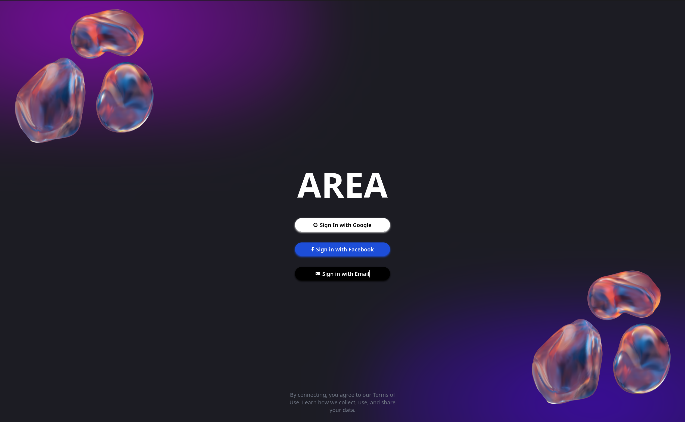
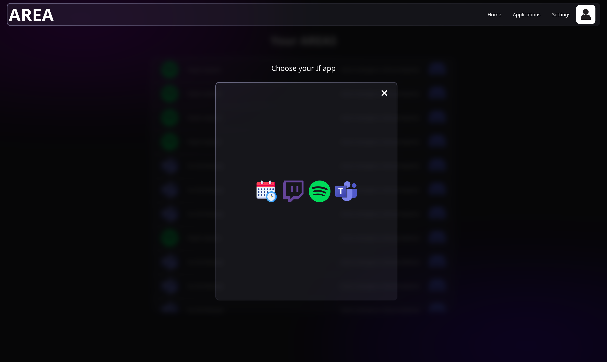

This page presents a selection of images illustrating the different interfaces of our project. Discover how our application works on both the web and mobile.

## Web

Here are some screenshots of the web application:

*The login screen of the web application, where users enter their credentials to access their accounts.*

*The sign-in screen allowing users to quickly access their accounts via social login options.*

*The history screen displaying the user's past actions and activities within the application.*

*The settings screen for users to manage their account preferences and configurations.*

*The Areas screen where users can manage different sections of their account and related activities.*

*The fields screen that allows users to customize their input fields and data management options.*

## Mobile

Here are some screenshots of the mobile application:

import MobileLoginScreen from '../static/img/mobile/login.jpg';
import MobileSignInScreen from '../static/img/mobile/signin.jpg';
import MobileEmailScreen from '../static/img/mobile/email.jpg';
import MobileHistoryScreen from '../static/img/mobile/history.jpg';
import MobileLibraryScreen from '../static/img/mobile/lib.jpg';
import MobileSettingsScreen from '../static/img/mobile/settings.jpg';
import MobileAreasScreen from '../static/img/mobile/action.jpg';
import MobileFieldsScreen from '../static/img/mobile/fields.jpg';

*The login screen of the mobile application, where users can enter their credentials to access their accounts securely.*

*The sign-in screen providing quick access options for users through social login methods.*

*The email input screen where users can conveniently log in using their email and password.*

*The history screen that displays the user's previous actions and interactions within the application.*

*The library screen showcasing the user's saved items and resources within the application.*

*The settings screen that allows users to configure their account preferences and manage their profile settings.*

*The Areas screen enabling users to oversee various sections of their accounts and related activities.*

*The fields screen that permits users to customize their input options and manage data more effectively.*

