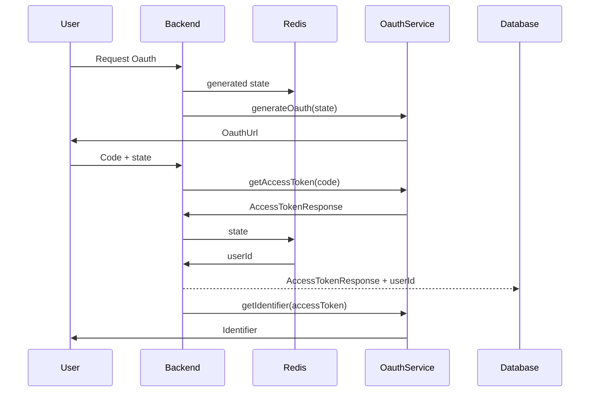

# OAuth

OAuth is an open standard for access delegation, commonly used as a way for Internet users to grant websites or applications access to their information on other websites but without giving them the passwords. This mechanism is used by Area to authenticate users with third-party services.

A Valid Oauth service must work with code flow and offline refresh token flow. The code flow is used to get the access token and the refresh token, while the refresh token flow is used to get a new access token from the refresh token.

A state parameter is generated for each Oauth request to prevent CSRF attacks and let the back-end link the request to the requesting user.

## Structure

Each Oauth service implements the following structure:

```ts
interface AccessTokenResponse {
    access_token: string;
    token_type: string;
    expires_in: number;
    refresh_token: string;
    scope: string;
}

export interface Oauth {
    // an unique identifier for the service
    id: string;
    // a logo or an image representing the service
    imageURL: string;
    //generate an oauth url for the service. The state parameter is used to prevent CSRF attacks
    generateOauth: (state: string) => string;
    //get the access token from the code returned by the oauth flow
    getAccessToken: (code: string) => Promise<AccessTokenResponse>;
    //get a new access token from a refresh token
    refreshAccessToken: (refreshToken: string) => Promise<AccessTokenResponse>;
    //returns a string that should let the user recognize the account they are connecting
    //it can be the username, the email, or any other relevant information
    getIdentifier: (accessToken: string) => Promise<string>;
    //revoke (delete) the access token
    revoke: (accessToken: string) => Promise<void>;
}
```

### Flow

URL generation:




## Implementation
 
Here is an example of a service implementation:

```ts
class MicrosoftOauth implements Oauth {
    id = "microsoft";

    scope = "User.Read offline_access Chat.Read Chat.ReadWrite ChannelMessage.Send Team.ReadBasic.All";

    imageURL = "https://upload.wikimedia.org/wikipedia/commons/4/44/Microsoft_logo.svg";

    generateOauth(state: string) {
        const searchParams = new URLSearchParams({
            client_id: process.env.MICROSOFT_CLIENT_ID!,
            redirect_uri: "http://localhost:8080/api/auth/microsoft",
            state,
            response_type: "code",
            response_mode: "query",
            scope: this.scope,
        });
        return `https://login.microsoftonline.com/common/oauth2/v2.0/authorize?${searchParams.toString()}`;
    };

    async getAccessToken(code: string) {
        const tokenResponseData = await fetch("https://login.microsoftonline.com/common/oauth2/v2.0/token", {
            method: "POST",
            body: new URLSearchParams({
                client_id: process.env.MICROSOFT_CLIENT_ID!,
                client_secret: process.env.MICROSOFT_CLIENT_SECRET!,
                code,
                redirect_uri: "http://localhost:8080/api/auth/microsoft",
                grant_type: "authorization_code",
                scope: this.scope,
            }).toString(),
            headers: {
                'Content-Type': 'application/x-www-form-urlencoded',
                "accept": "application/json",
            },
        });
        const response = await tokenResponseData.json();
        return response;
    };

    async refreshAccessToken(refreshToken: string) {
        const tokenResponseData = await fetch("https://login.microsoftonline.com/common/oauth2/v2.0/token", {
            method: "POST",
            body: new URLSearchParams({
                client_id: process.env.MICROSOFT_CLIENT_ID!,
                client_secret: process.env.MICROSOFT_CLIENT_SECRET!,
                refresh_token: refreshToken,
                grant_type: "refresh_token",
            }).toString(),
            headers: {
                'Content-Type': 'application/x-www-form-urlencoded',
                "accept": "application/json",
            },
        });
        const response = await tokenResponseData.json();
        return response;
    };

    async getIdentifier(accessToken: string) {
        const userInfoResponse = await fetch("https://graph.microsoft.com/v1.0/me", {
            headers: {
                Authorization: `Bearer ${accessToken}`,
            },
        });
        const response = await userInfoResponse.json();
        return response.mail;
    };

    async revoke(accessToken: string) {
        await fetch("https://login.microsoftonline.com/common/oauth2/v2.0/logout", {
            method: "POST",
            headers: {
                Authorization: `Bearer ${accessToken}`,
            },
        });
    };
}

// Export a singleton instance of the service
export default new MicrosoftOauth();
```
