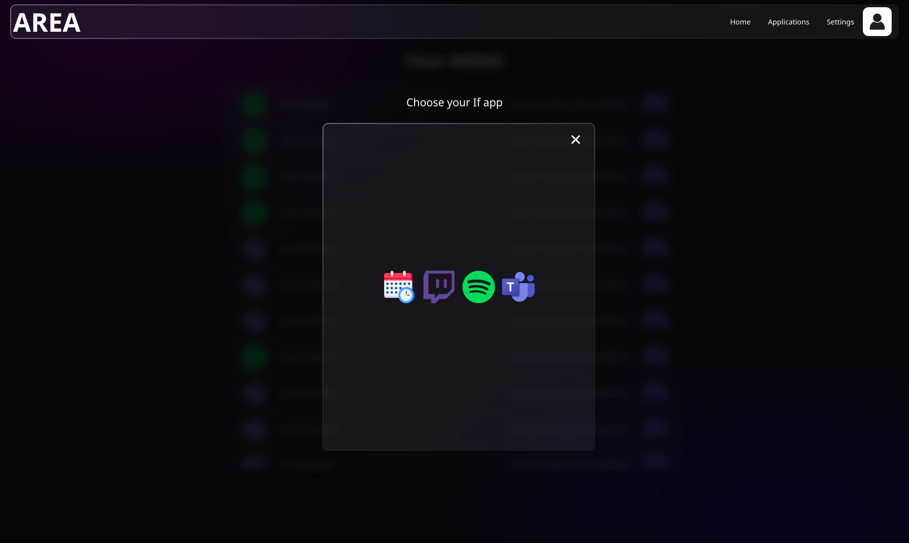

# Dashboard

The **Dashboard** is the central hub of the AREA application, designed to provide you with a comprehensive view of your webhooks and activities. It facilitates efficient management and monitoring of your integrations with various services.

## Key Features

- **Webhook Management**: Easily create, edit, and delete your webhooks from a single location. The intuitive interface allows you to configure webhook settings with minimal effort.

- **Activity Monitoring**: Stay updated on the status and performance of your webhooks. Receive real-time notifications and insights on the actions being triggered and the reactions that follow.

- **Quick Access**: Navigate seamlessly to different sections of the application, such as Services, Profile, and Documentation, all from the Dashboard.

## Create a New AREA

You can create an AREA from the Dashboard page. To do this, follow these steps:

1. **Select a Trigger**: 
   - Use the dropdown to select the service you want to use.
   - Choose the specific trigger from the available options.

2. **Choose a Reaction**: 
   - Select a reaction in the same manner as you selected the trigger.

> **Note**: You can’t select a trigger or a reaction from a service you are not registered to.

## Action-Reaction Model

The Dashboard supports a variety of action-reaction scenarios to automate your workflow effectively. Here are some examples:

### Actions

- **Create Webhook**: Initiate the creation of a new webhook to connect with a specific service (e.g., Discord, GitHub).
- **Edit Webhook**: Modify existing webhooks to adjust triggers or update settings as needed.
- **Delete Webhook**: Remove webhooks that are no longer necessary for your projects.

### Reactions

- **Trigger Notifications**: When a specific action occurs (e.g., a new message in Discord), trigger notifications to alert users or initiate other actions.
- **Log Activity**: Record all actions taken within the Dashboard for audit purposes, ensuring you have a clear history of webhook interactions.
- **Update Status**: Automatically update the status of connected services based on the actions performed, providing real-time insights into your workflows.

By leveraging the Dashboard's capabilities, you can streamline your processes, enhance productivity, and ensure a cohesive workflow within the AREA application.

### Example

