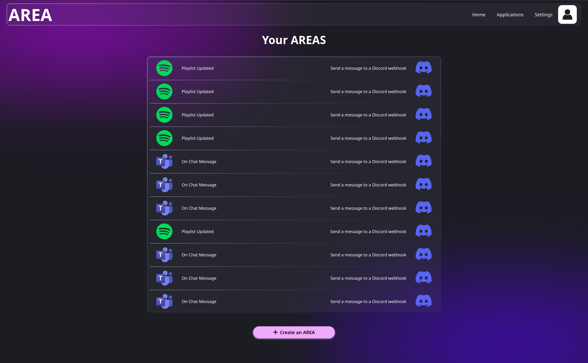

# Home

Welcome to the AREA application! This is the landing page where you can access all key functionalities and features of the app. Here, you can navigate to different sections, including your service history and recent activities.

## Access Your Service History

On the Home Page, you have the ability to view your historical data related to the services you've used within the AREA application. This feature allows you to:

- **Review Actions Taken**: See a comprehensive list of all actions triggered through your registered services, including timestamps and details of each action.
- **Monitor Reactions**: Check the corresponding reactions initiated by these actions, helping you understand the workflow and automation process.
- **Filter by Service**: Use the filtering options to view history for specific services, making it easier to analyze interactions and outcomes.

### Key Features of the Home Page

- **User-Friendly Interface**: Navigate effortlessly through the application with a clean and intuitive design.
- **Quick Links**: Access important sections such as your Profile, Dashboard, and Services with just a click.
- **Recent Activities Overview**: Get a snapshot of your recent activities and integrations, ensuring you're always updated on your usage.

### How to Use the Service History

1. **Navigate to the History Section**: Click on the "History" link available on the Home Page.
2. **Choose Your Filters**: If desired, select filters to narrow down your view based on service or date range.
3. **View Details**: Click on individual entries to see more details about specific actions and reactions.

By utilizing the Home Page effectively, you can stay organized, keep track of your activities, and make the most of the features available within the AREA application. Enjoy your experience!

### Example

