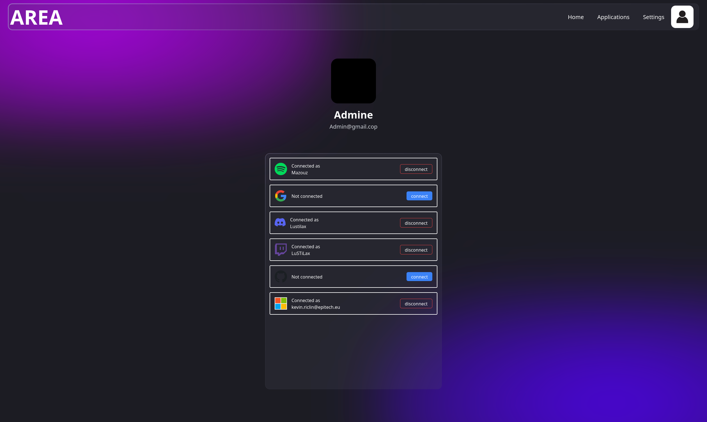

# Register to a Service

In this section, you can view the services you are currently registered to within the AREA application. Registering for additional services allows you to unlock new Triggers and Reactions that can be used in your AREAs, enhancing your automation capabilities.

## Current Registrations

Here’s a list of services you are already registered with:

- **Discord**: Stay connected with your teams and receive real-time notifications.
- **GitHub**: Manage your repositories and issues seamlessly.
- **Microsoft Teams**: Collaborate efficiently with your colleagues.
- **Spotify**: Enhance your music experience with automated playlists.
- **YouTube**: Keep track of your favorite videos and channels.

## Register for New Services

To register for additional services, follow these steps:

1. **Choose a Service**: Select from the list of available services that you wish to register for.

2. **Authorize Access**: Complete the authorization process to grant the AREA application the necessary permissions to interact with the selected service.

3. **Unlock Triggers/Reactions**: Once registered, you will be able to access new Triggers and Reactions specific to that service, which can be integrated into your AREAs.

### Benefits of Registering

- **Expanded Functionality**: By registering for more services, you can create more complex and valuable automations tailored to your needs.
- **Increased Automation**: Utilize new Triggers and Reactions to automate various workflows across different platforms.
- **Seamless Integration**: Enjoy a cohesive experience as AREA connects with your favorite services, streamlining your tasks and activities.

Take advantage of the registration feature to enhance your experience with the AREA application and make the most out of your automation possibilities!

### Example

