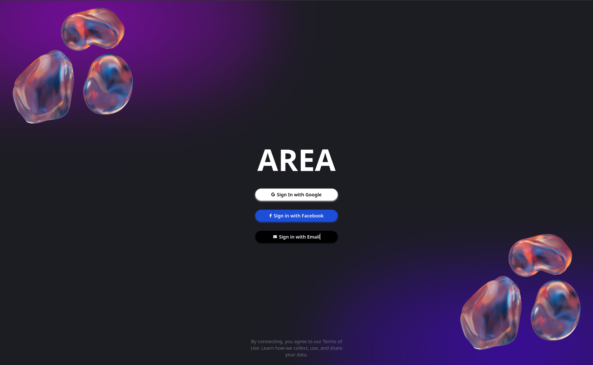

# Login

Welcome to the AREA application! To get started, you have two convenient options to log in:

## 1. Standard Login

Use your registered email and password to log in. This method provides a secure way to access your personal workspace and settings.

- **Email**: Enter your registered email address.
- **Password**: Type in your secure password.

## 2. Google Login

Alternatively, you can log in using your Google account. This option allows for quick access, and once connected, you’ll be automatically logged in each time you visit the login page, unless you manually log out of the application.

### Benefits of Google Login
- **Faster Access**: Skip the hassle of entering your credentials.
- **Seamless Experience**: Stay logged in effortlessly.

### Example

